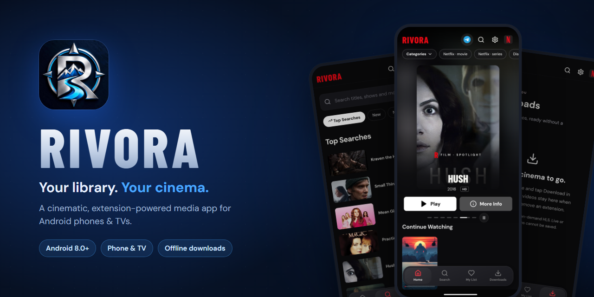
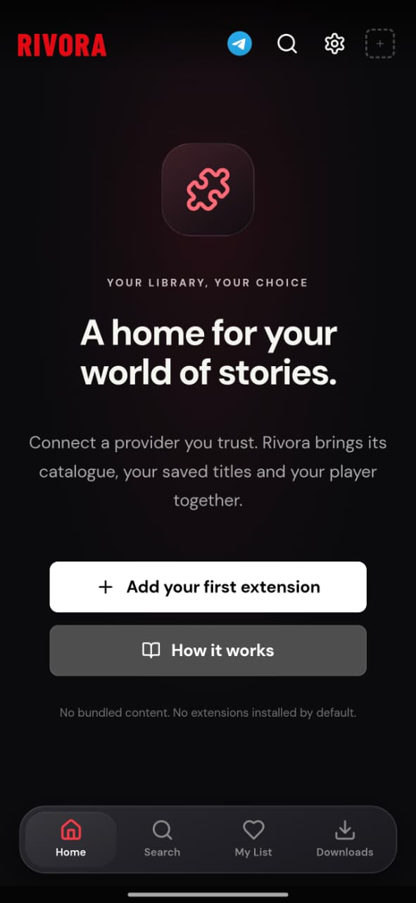
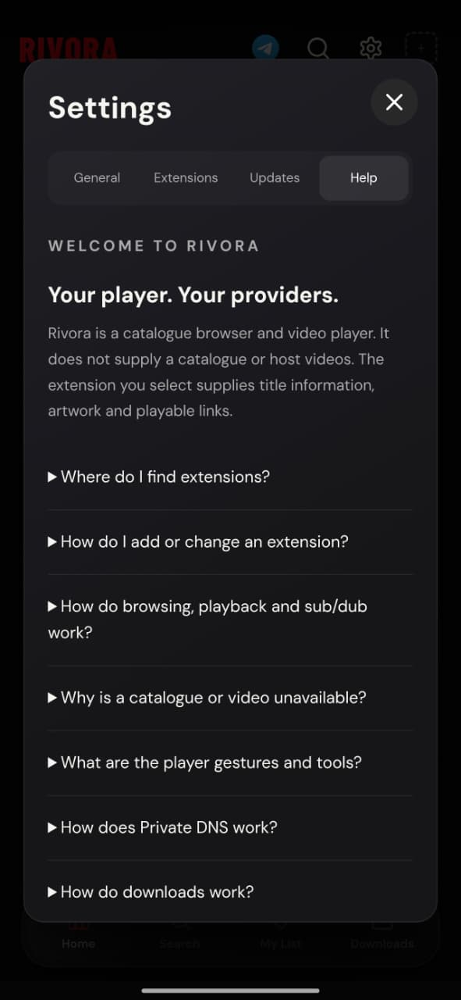
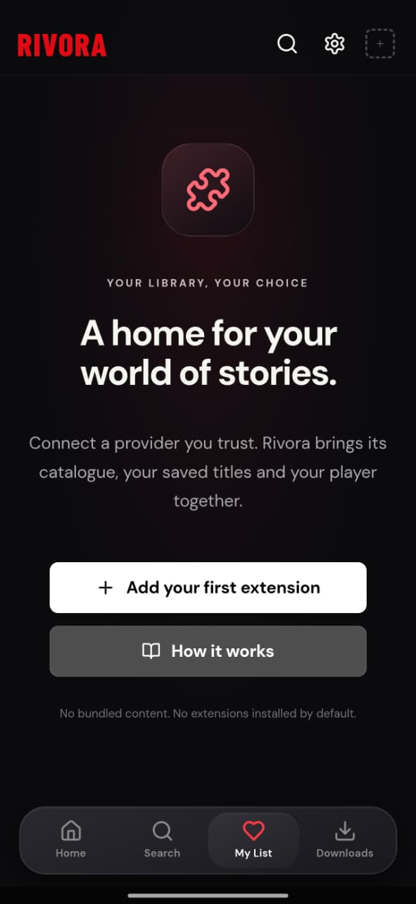
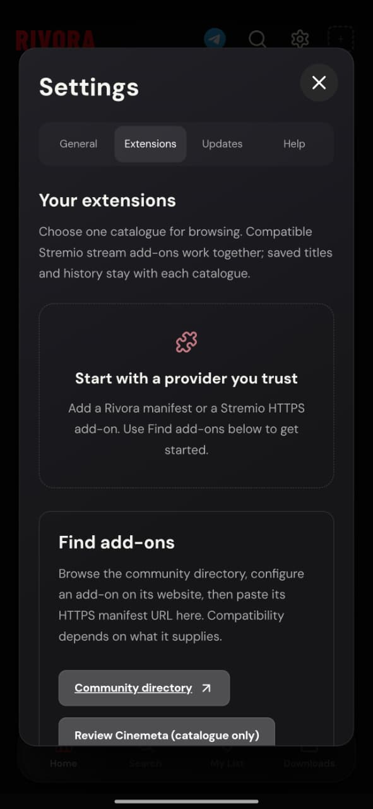
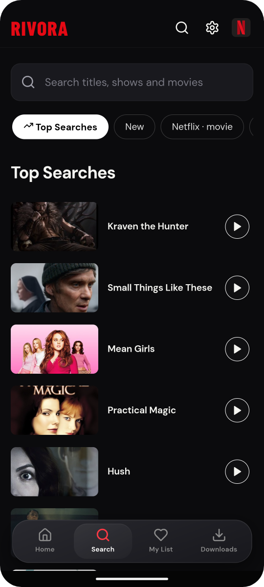
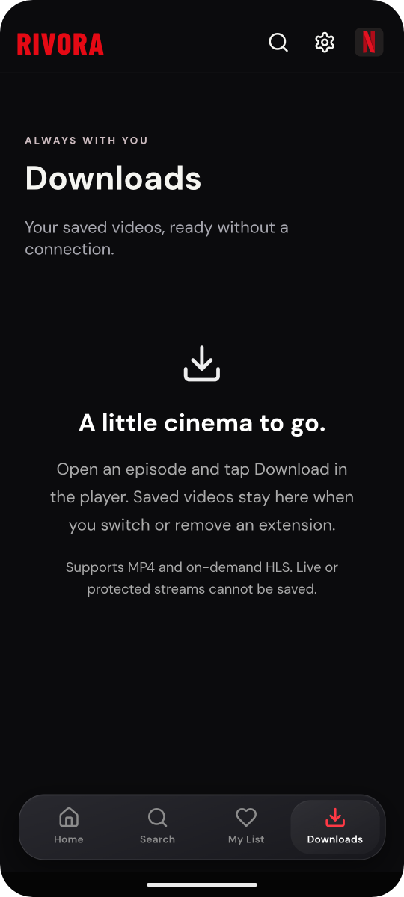
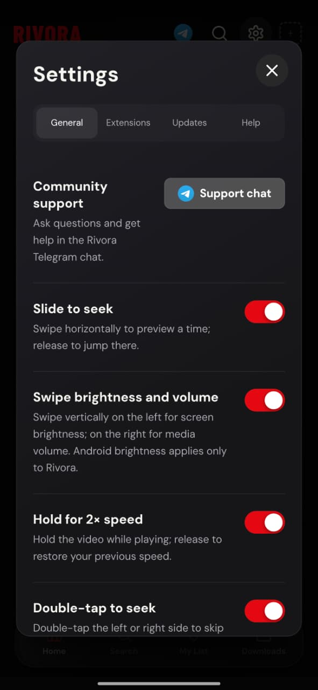
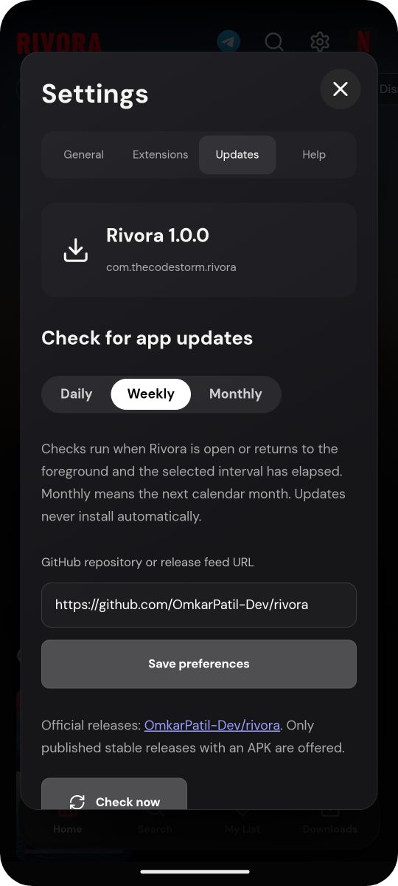

  

  
  
  
  

  

  
  
  

  <a href="#-screenshots">Screenshots</a> •
  <a href="#-features">Features</a> •
  <a href="#-install">Install</a> •
  <a href="#-adding-extensions">Extensions</a> •
  <a href="#-faq">FAQ</a> •
  <a href="#-community--support">Support</a>

---

## ✨ About

**Rivora** is a cinematic media app for Android devices and Android TV. It gives you a big-screen streaming-style experience — a moving spotlight, catalogue rows, rich title pages, a gesture-driven player and offline downloads — for **the catalogues and providers you choose**.

Rivora ships with **no built-in content**. You add your own extensions (Rivora manifests or compatible Stremio HTTPS add-ons) and Rivora turns them into a beautiful, fast, remote-friendly library.

> [!NOTE]
> Rivora is **closed source**. This repository hosts the official APK releases, screenshots, documentation and the issue tracker.

## 📸 Screenshots

<table>
  <tr>
    <td align="center" width="25%"> <b>Spotlight home</b></td>
    <td align="center" width="25%"> <b>Continue watching & rows</b></td>
    <td align="center" width="25%"> <b>Quick preview</b></td>
    <td align="center" width="25%"> <b>Title details</b></td>
  </tr>
  <tr>
    <td align="center"> <b>Search</b></td>
    <td align="center"> <b>Offline downloads</b></td>
    <td align="center"> <b>Player settings</b></td>
    <td align="center"> <b>Built-in updates</b></td>
  </tr>
</table>

Real screenshots from Rivora 1.0.0 on Android. Titles, artwork and brand logos shown are supplied by a user-installed extension and belong to their respective owners — they are not part of the app.

## 🚀 Features

<table>
  <tr>
    <td width="50%" valign="top">

### 🎬 Cinematic browsing
- Auto-rotating **spotlight** with Play / More Info
- Catalogue rows, categories and **Continue Watching**
- Quick-preview sheet and full title pages with seasons & episodes
- **My List** to save titles for later
- Fast search with Top Searches and catalogue filters

</td>
    <td width="50%" valign="top">

### 🧩 Your sources, your choice
- Install **Rivora JSON manifests** or compatible **Stremio HTTPS add-ons**
- Netflix-style **“Who’s streaming?”** extension switcher
- Separate saved titles & history per catalogue
- Stream add-ons work alongside your selected catalogue
- Review every extension before it's added

</td>
  </tr>
  <tr>
    <td valign="top">

### ▶️ A player that responds
- Swipe left for **brightness**, right for **volume**
- **Hold for 2× speed**, double-tap to seek (5 / 10 / 30 s)
- Fit / Fill / Stretch, playback speed, touch lock
- **Sleep timer** and next-episode autoplay countdown
- Automatic fallback to the next source, or open in another player

</td>
    <td valign="top">

### 📥 Watch anywhere
- Save **MP4** and on-demand **HLS** videos for offline playback
- Downloads stay even if you switch or remove an extension
- Optional unmetered-only downloads and quality preference
- Dedicated **Downloads** tab with gesture controls

</td>
  </tr>
  <tr>
    <td valign="top">

### 📺 Phone & TV
- Touch-first layout for phones
- Remote / D-pad friendly layout for Android TV
- Fullscreen, immersive dark interface

</td>
    <td valign="top">

### 🔒 Thoughtful extras
- **App lock** with fingerprint / face or device PIN
- Recents thumbnails hidden while locked (Android 13+)
- Haptic feedback, quality & player preferences
- **Daily / weekly / monthly update checks** from this repo — never installs silently

</td>
  </tr>
</table>

## 📲 Install

1. Go to **[Releases → Latest](https://github.com/OmkarPatil-Dev/rivora/releases/latest)**.
2. Under **Assets**, download the `rivora-x.y.z.apk` file.
3. Open the APK on your phone or TV. If Android asks, allow **Install unknown apps** for your browser or file manager.
4. Launch **Rivora** 🎉

| Requirement | |
| :--- | :--- |
| Android version | **8.0 (Oreo) or newer** |
| Devices | Phones, tablets and Android TV |
| Package name | `com.thecodestorm.rivora` |
| Architectures | ARM devices (arm64-v8a, armeabi-v7a) |

> [!TIP]
> Already have Rivora? Open **Settings → Updates → Check now**. The app checks this repository for new releases on your chosen schedule and opens the release page for you to review.

## 🧩 Adding extensions

Rivora starts empty — add a catalogue to fill your home screen.

1. Open **Settings → Extensions** (or tap the profile picture → **Add extension**).
2. Paste a trusted provider's **HTTPS manifest URL**.
3. Review the name, publisher and permissions, then tap **Add and use**.
4. Pick a catalogue from the top-right switcher, open a title and press **Play**.

> [!IMPORTANT]
> A **catalogue** provides titles and artwork; a **stream source** provides playable links. Some add-ons do only one of these, so you may need both.

**Supported:** Rivora Provider API v1 manifests · Stremio HTTPS add-ons
**Not supported:** Cloudstream plugins · Mihon/Tachiyomi extensions · DRM-protected streams

Building your own provider? See the **[Rivora Provider API v1](docs/PROVIDER-API.md)**.

## ❓ FAQ

<b>Does Rivora include movies, shows or subscriptions?</b>

 

No. Rivora is a catalogue browser and media player. It does not host, sell or bundle any videos, and it ships without any extensions. What you can watch depends entirely on the providers you add. Only use sources you are entitled to access.

<b>Why won't a video play?</b>

 

Playback depends on the source's container, codecs and your device. Try **Other sources** in the player, or **Open in another app** (e.g. VLC / MX Player). Audio formats like AC3, E-AC3, DTS and TrueHD, and some 4K/HEVC/AV1 files, may not play in the built-in player.

<b>How do updates work?</b>

 

Rivora checks this repository's latest stable release daily, weekly or monthly (your choice) while the app is open, or whenever you tap **Check now**. When a newer version exists it opens the release page — nothing is downloaded or installed without you.

<b>Is my data shared?</b>

 

Your extensions, My List and watch progress stay on your device. Rivora sends basic device and usage information to its own service. Read the full **[Privacy notice](PRIVACY.md)**.

<b>Is Rivora open source?</b>

 

No. Rivora is closed-source, proprietary software. You may download and use the official APKs from this repository; see the **[License](LICENSE)**.

## 💬 Community & support

| | |
| :--- | :--- |
| 📢 **Announcements** | [t.me/RivoraApp](https://t.me/RivoraApp) |
| 💬 **Help & chat** | [t.me/RivoraAppChatroom](https://t.me/RivoraAppChatroom) |
| 🐞 **Bug reports** | [Open an issue](https://github.com/OmkarPatil-Dev/rivora/issues/new/choose) |
| 📝 **What's new** | [Changelog](CHANGELOG.md) |

When reporting a problem, please include your **app version, device model, Android version, extension name and the exact error text**. Never post passwords, tokens or private provider URLs.

---

  

 

  <b>Rivora</b> · Crafted with ♥ by <b>TheCodeStorm</b> 
  © 2026 TheCodeStorm. All rights reserved. Rivora is an independent app and is not affiliated with, endorsed by or sponsored by any streaming service. All trademarks and artwork shown belong to their respective owners.

